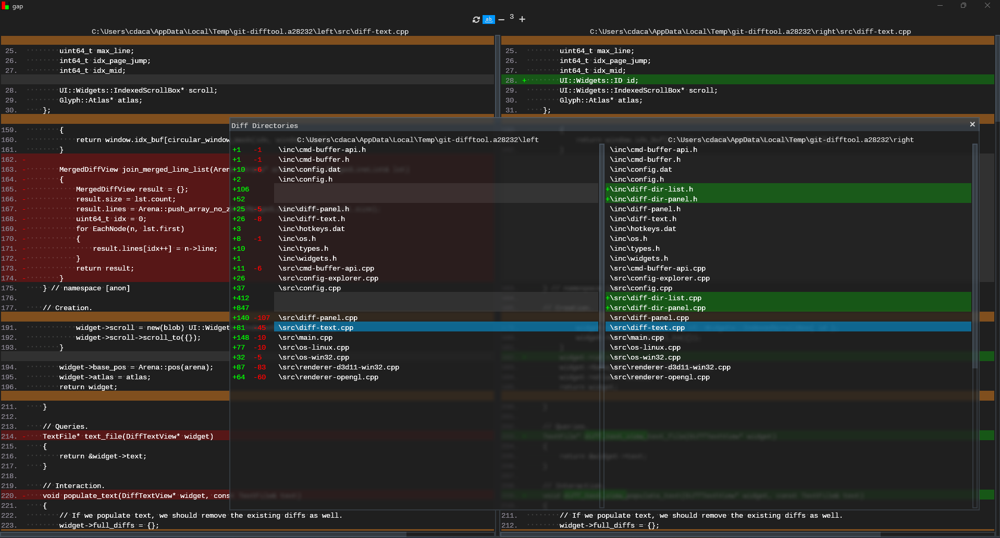

<p align="center">
    <br/><br/>gap - GUI Text Diff.<br/><br/>
</p>

# gap
This is a very simple text GUI diffing utility started during the [Handmade Essentials 2026 Jam](https://handmade.network/jam/essentials).

The goal of **gap** is to provide a very simple native utility which presents diffs in a way that you might see them on popular source control sites such as Github or Azure DevOps.

The secondary goal of **gap** is to serve as a proof-of-concept for implementing the linear variant of the Myers diff algorithm for use in [fred](https://fred-dev.tech).

## Features
* Self-contained repo.  There are no dependencies outside of a C++ compiler (some Linux caveats).
* Multiple options for viewing inner-diffs within similar blocks (word-based and character-based).
* Easily swap the order of diffs with a single button.
* Expand/collapse context window at the push of a button (anything below 0 indicates 'infinite' context, implying there is no window).
* Supports directory diffing where each file in the corresponding directory is matched to files in the opposite directory.
* Full configuration explorer just like in **fred** from which you can change settings such as viewing line numbers, changing colors, or disabling animations.
* Help panel which provides hotkey rebinding.
* Multiple renderer options on Windows (DX11 and OpenGL with DX11 being default).
* Supports subpixel font rendering (on by default).
* Supports both Windows and Linux (no OSX).

## Usage
```
$ gap a.txt b.txt # file diffing.
$ gap .\A .\B     # directory diffing.
```
Or simply open **gap** and drag-and-drop files onto each panel side for diffing.  You can overwrite a file by dragging and dropping a new file onto that panel.  You can also open the directory diffing panel via the default of `CTRL+O` and drag directories onto each side for a directory comparison.

Another way of using gap is to tie it into git for viewing local diffs:

```
$ git config difftool.gap.path "D:/git_projects/gap/build/gap.exe"
$ git config difftool.gap.cmd "D:/git_projects/gap/build/gap.exe """$LOCAL""" """$REMOTE""""
$ git config diff.tool gap
```
Which you can then use `git difftool` instead of `git diff` to view diffs locally.

Additionally, you may want to consider invoking `git difftool` as `git difftool -d` to take advantage of the directory diffing in gap.

On Linux you would simply escape the quotes differently and alter paths.

## Screenshots




## Building

Windows:
1. Open up an VS2022 (or later) x64 Developer Command Prompt
```
$ build
```
Or for release:
```
$ build release
```

Linux:
1. Ensure you have a recent-ish version of gcc.  I used 13.3.0.
2. Have the following system dependencies installed:
    * OpenGL (I used libglx-dev)
    * X11 (I used libx11-dev)
    * X11-ext (I used libxext-dev)
    * Xrandr (I used libxrandr-dev)
```
$ ./build.sh
```
Or for release:
```
$ ./build.sh release
```

## License
MIT